# 🎬 mcassets
*Here are Dragons*

List of assets you can use in your maps.

## Compass

###  Cosmographie universelle (1555)
Author:  Le Testu, Guillaume
[BnF](https://gallica.bnf.fr/ark:/12148/btv1b8447838j/) © Public Domain    
[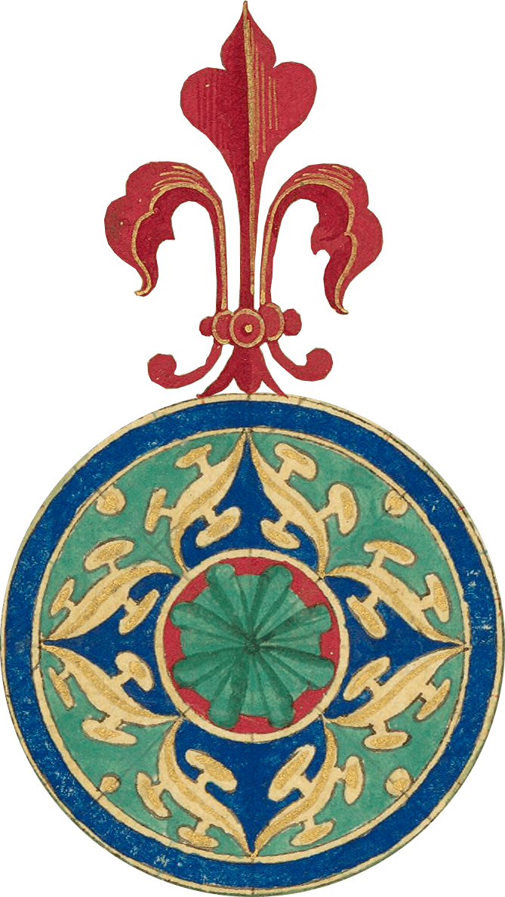](./img/compass/bnf-btv1b8447838j-116.png)

## Ships

### « Les premieres Œuvres de JACQUES DEVAULX, pillote en la marine ».
Author:  JACQUES DEVAULX
[BnF](https://gallica.bnf.fr/ark:/12148/btv1b550024840/f67.item) © Public Domain   
   

### Hendrick & Arnold Van Langren (1599)
[BnF](https://gallica.bnf.fr/ark:/12148/btv1b84684314/) © Public Domain  
[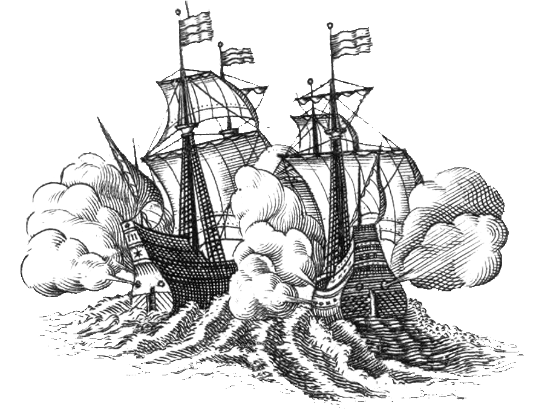](./img/portulan/bnf-btv1b84684314-1.png) [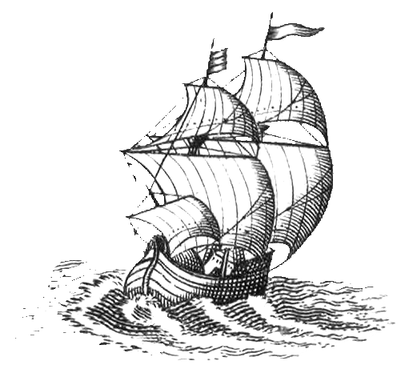](./img/portulan/bnf-btv1b84684314-2.png)

## Monsters

### Côte depuis la Pointe du Grouin jusqu'au Cap Fréhel - 1600-1799
[BnF](https://gallica.bnf.fr/ark:/12148/btv1b59055799/f1.item)  © Public Domain   

###  Cosmographie universelle (1555)
Author:  Le Testu, Guillaume
[BnF](https://gallica.bnf.fr/ark:/12148/btv1b8447838j/) © Public Domain    

### Hendrick & Arnold Van Langren (1599)
[BnF](https://gallica.bnf.fr/ark:/12148/btv1b84684314/) © Public Domain  
[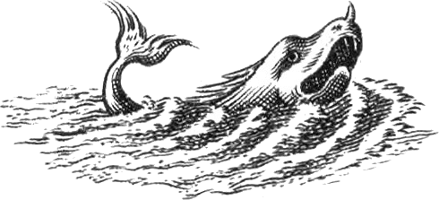](./img/monster/bnf-btv1b84684314-1.png)  [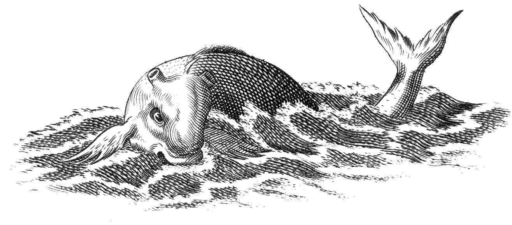](./img/monster/bnf-btv1b84684314-3.png) 

## Mythology

### Neptune Balthasar de Beaujoyeulx, Balet comique de la Royne (1582)
[BnF](https://essentiels.bnf.fr/fr/image/4cf40b3c-b856-4181-bc3d-b5ea321c18c0-neptune) © Public Domain    

## Sea creatures

### « Les premieres Œuvres de JACQUES DEVAULX, pillote en la marine ».
Author:  JACQUES DEVAULX
[BnF](https://gallica.bnf.fr/ark:/12148/btv1b550024840/) © Public Domain   
[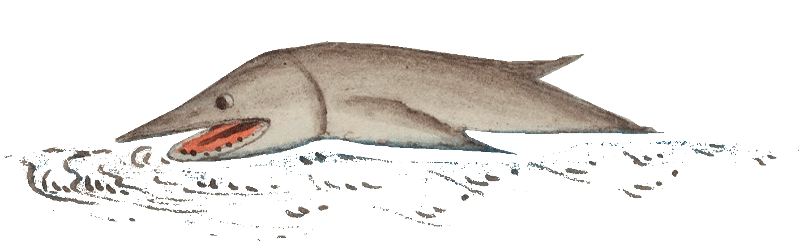](./img/marin/swordfish_btv1b550024840_88.png) 

## Animals

###  Cosmographie universelle (1555)
Author:  Le Testu, Guillaume
[BnF](https://gallica.bnf.fr/ark:/12148/btv1b8447838j/) © Public Domain    
 [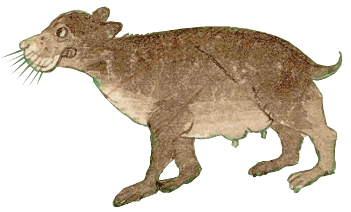](./img/animal/bear-btv1b8447838j_108.png)   

### Hendrick & Arnold Van Langren (1599)
[BnF](https://gallica.bnf.fr/ark:/12148/btv1b84684314/) © Public Domain    
[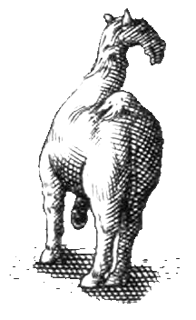](./img/animal/camel-btv1b84684314.png) [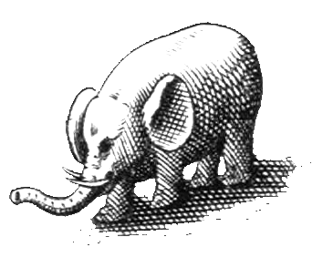](./img/animal/elephant-btv1b84684314.png) [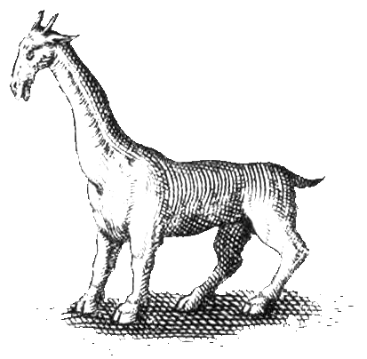](./img/animal/giraffe-btv1b84684314.png) [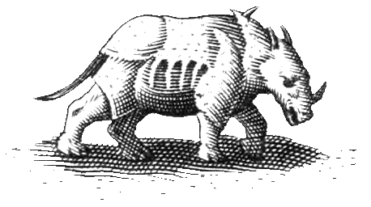](./img/animal/rhinoceros-btv1b84684314.png)

